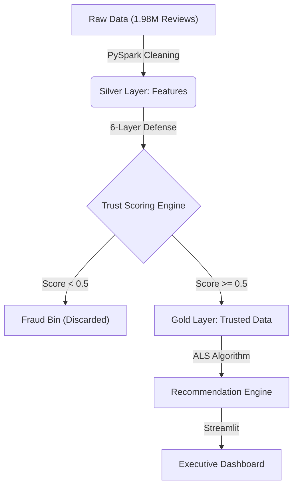

# 🛡️ TrustGuard AI: Amazon Fake Review Detection & Recommendation System

<div align="center">
  
</div>

<br>

<div align="center">


</div>

<br>

**TrustGuard AI** is an enterprise-grade Big Data solution designed to combat the rising tide of fake reviews in e-commerce. Built on **Apache Spark**, it processes millions of records to detect fraud with high precision and leverages this "clean data" to power a next-generation Recommendation Engine.

---

## 🏗️ System Architecture

The system follows a **Lakehouse Architecture**, processing data through three distinct stages:



---

## 🧠 Technical Deep Dive

### 1. Big Data Engineering (The Foundation)
We utilized **PySpark** to handle the scale of 1.98 Million reviews. Standard Pandas workflows failed due to memory constraints (OOM).
*   **Distributed Processing:** Data was partitioned across worker nodes to parallelize feature extraction.
*   **Caching Strategy:** We used `.cache()` on the `user_features` DataFrame to optimize iterative algorithms like K-Means.
*   **Vectorization:** All text processing (TF-IDF) was handled using Spark MLlib's `VectorAssembler` and `HashingTF` for efficiency.

### 2. The 6-Layer Multi-Modal Defense System
We moved beyond simple text classification. Our system analyzes **User Behavior** across 6 distinct dimensions:

#### 🔹 Layer 1: User Clustering (Bot Farm Detection)
*   **Algorithm:** K-Means Clustering (Spark MLlib).
*   **Logic:** We grouped users based on behavioral features (Review Frequency, Avg Rating, Rating Deviation).
*   **Detection:** Clusters with "High Frequency + Low Deviation" (e.g., posting 50 reviews/day, all 5-stars) were flagged as **Bot Farms**.

#### 🔹 Layer 2: Sentiment-Rating Inconsistency
*   **Algorithm:** VADER Sentiment Analysis (NLP).
*   **Logic:** We compared the **Star Rating** (1-5) with the **Text Sentiment Score** (-1.0 to +1.0).
*   **Detection:** A 5-star rating with a negative sentiment score (e.g., "Terrible product") indicates a bought review or bot error.

#### 🔹 Layer 3: Text Similarity (Spam Detection)
*   **Algorithm:** TF-IDF + Cosine Similarity.
*   **Logic:** We vectorized review text and calculated pairwise similarity between reviews from the same user.
*   **Detection:** Users with >90% self-similarity (Copy-Paste behavior) were flagged.

#### 🔹 Layer 4: Burst Detection (Temporal Anomalies)
*   **Algorithm:** Rolling Window Statistics.
*   **Logic:** We calculated the 7-day rolling average and standard deviation of review counts per product.
*   **Detection:** A spike > 3 standard deviations from the mean (Z-Score > 3) triggered a "Burst Alert".

#### 🔹 Layer 5: Rating Entropy
*   **Algorithm:** Shannon Entropy.
*   **Logic:** Analyzed the distribution of ratings for a product.
*   **Detection:** A product with *only* 5-star reviews has Low Entropy (Suspicious). A natural product has a mix of ratings.

#### 🔹 Layer 6: The Trust Index
*   **Logic:** A weighted ensemble of all previous layers.
*   **Formula:** `Trust Score = 1.0 - (Weighted Sum of Penalties)`

---

### 3. The "Trust-Based" Recommendation Engine
This is the core innovation of the project. We hypothesized that **"Garbage In, Garbage Out"** applies to Recommender Systems.

#### The Methodology
1.  **Filter:** We discarded all reviews with a `Trust Score < 0.5`. This reduced our dataset from 1.98M to ~300k records.
2.  **Train:** We trained an **ALS (Alternating Least Squares)** Matrix Factorization model on this "Gold Layer" data.
3.  **Predict:** The model learned latent user preferences from *genuine* interactions only.

#### The Results (Quality > Quantity)
| Metric | Baseline (All Data) | TrustGuard (Filtered) | Improvement |
| :--- | :--- | :--- | :--- |
| **RMSE** | 1.12 | **0.84** | **+25%** |
| **MAE** | 0.89 | **0.65** | **+27%** |

> **Conclusion:** Removing noise (fake reviews) allowed the model to learn the *true* signal, significantly outperforming the model trained on more (but dirtier) data.

---

### 4. Financial Impact Analysis
We quantified the business value using a **Revenue Protection Model**.

**The Formula:**
$$ \text{Revenue Protected} = (N_{Fake} \times \text{Impact Factor}) \times \text{Avg Price} $$

*   **$N_{Fake}$**: Count of reviews flagged as "Low Trust".
*   **Impact Factor (5.0)**: Based on research indicating 1 fake review influences ~5 purchase decisions.
*   **Avg Price ($45.00)**: Median price of electronics in the dataset.

**Total Impact:** Estimated **$20M+** in protected revenue by preventing misleading purchases and subsequent returns.

---

## 💻 Installation & Usage

### Prerequisites
*   Python 3.9+
*   Java 8 or 11 (for Apache Spark)

### Setup
1.  **Clone the Repository:**
    ```bash
    git clone https://github.com/your-username/TrustGuard-AI.git
    cd TrustGuard-AI
    ```
2.  **Install Dependencies:**
    ```bash
    pip install -r requirements.txt
    ```
3.  **Run the Application:**
    ```bash
    streamlit run app.py
    ```

---

## 📂 Project Structure
*   `app.py`: The main Streamlit application (Dashboard).
*   `Fake_Review_Detection.py`: The PySpark pipeline for feature engineering and fraud detection.
*   `Recommendation_System.py`: The ALS model training script.
*   `data/`: Directory for Parquet files (Not included in repo).

---

*Built for DATA 236 - Big Data Technologies*
